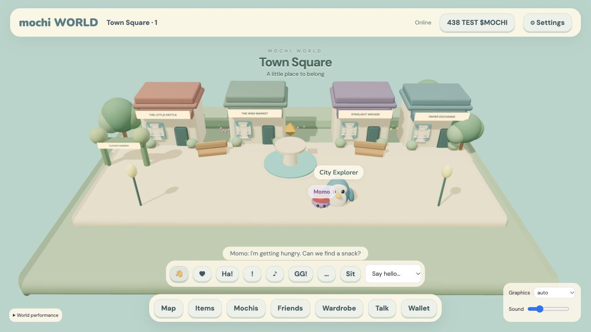

# React Three Fiber migration · 2026-10-05

The local app at http://127.0.0.1:8777/home now enters a full-screen3D social world.
No real token transfer, LLM request, treasury execution or deployment occurred.

1. **Preserved:** PostgreSQL52 tables, session ownership, one owned companion, original
   Momo life/checkpoint, Cadence/native worker/version/leases, immutable packs, pet needs,
   care/preferences, trading/risk/market providers/cups, items/inventory/stock/escrow/shops,
   collections/achievements/trophies/dailies/events/friends, wallets/payments/treasury.
2. **Replaced:** primary Phaser renderer, fixed2D canvas/page framing and straight-line
   walking. Phaser npm runtime/vendor route removed; prior source remains for reference.
3. **Architecture:** React/R3F Canvas, declarative room/character components, model asset
   boundary, world-space Html, scene adapter over existing socket events; Vite ES bundle.
   React backpack/conversation/graphics controls and React dialog shells for preserved panels.
   Detailed shop/profile/trading/wallet content remains the existing ES-module implementation.
4. **Dependencies:** react/react-dom, three, @react-three/fiber, @react-three/drei, Vite.
   Exact versions are pinned by package-lock.json. No remote art/font/model dependency.
5. **Scenes:** Town, Café, Park, Market, Arcade, Exchange, Arena, Lab, Home use reusable
   environment components and different palette/props. Town has the strongest treatment:
   original storefronts, crystal fountain, planting, benches, lamps and garden entrance.
   Other rooms are coherent prototypes, not claimed as finished production interiors.
6. **Camera:** elevated perspective43° FOV, fixed rotation, damped limited follow; wider
   mobile camera. No free camera. User zoom/rotation is deferred.
7. **Movement:** floor raycast → shared NavigationService → validated server A* grid path,
   shortcut smoothing, obstacle footprints, server acceleration/deceleration/rotation,
   10Hz updates and client interpolation with procedural waddle/turn smoothing.
8. **Avatar:** independent player-controlled penguin, persistent color/name and7 cosmetic
   layers plus backward-compatible accessory. Named socket bones and individual accessories;
   original skinned GLB prototype, isolated skeleton/mixer, procedural emote animation.
9. **Companion:** unique owned active Mochi, cached GLB with independent skeleton,
   CompanionFollowController routes around obstacles; bounded deterministic follow/wander/
   rest/return safety. Backend-success care events trigger visible pet reaction. No invented
   learned social behavior. Existing real needs/preferences/relationships are retained.
10. **Bubbles:** plain bounded text anchored with Drei Html, max3 queued/character,
    3.5–8sec expiry; configurable30–90sec autonomous gap and max3 environment replies/room/tick, click dismissal, stale timers isolated across room changes. Nameplates,
    HUD and conversation history provide text. Collision avoidance between several3D bubbles
    and sophisticated distance fading remain unfinished.
11. **Conversation:** React private-by-default dialog/history/public-reply checkbox;
    existing owned context,6/minute/one concurrent request, sanitization, template fallback
    and optional server-only Responses provider preserved. No trade/reward execution path.
12. **Cadence:** no neural input/motor/settlement change. Existing per-pet state and versioned
    checkpoints continue; rendering/movement do not tick Cadence/trading. Learned social
    observations/motors need measured assays against the simpler control before adoption.
13. **Multiplayer:** same-origin authenticated sockets, authoritative instances/capacity40,
    server paths/rotation,10Hz compact presentation state, reconnect/stale/duplicate cleanup.
    Existing accepted friends preferentially share a non-full instance. Memory RoomStore is
    local; a distributed Redis adapter is explicitly not implemented.
14. **Wallet:** existing nonce/account/origin-bound Ed25519 linking and public-key uniqueness.
    Connecting/signing messages/transaction transfers remain distinct. No private keys.
15. **$MOCHI:** bigint raw units, on-chain real balance, independently verified finalized SPL
    intent proof, reserved stock/listings, unique signatures, transactional item fulfillment.
    This run uses explicitly labeled TEST$MOCHI. Live wallet transfer-link/manual signature
    flow remains untested; reconciliation/refunds and integrated builder remain future work.
16. **$CADENCE:** qualifying NPC receipts/fees only, configured BPS remains unset if absent;
    offline reviewed acquisition/burn proof recording, transparent verified signatures.
    No automated hot-wallet trading/burn; direct signer adapter, multisig remains future work.
17. **Database:** additive existing migrations rerun successfully; no new table/drop/reset
    required for3D. Furniture snap positions live in existing pet profile.homePositions,
    tied to owned equipped homeSlots, transactional owner validation and occupancy checks.
18. **Environment:** adds MULTIPLAYER_STORAGE=memory and MOCHI_AUTONOMOUS_SPEECH_GAP_MS=45000; all prior token/dialogue/market flags
    retained. Local graphics quality/sound preferences use browser storage, not secrets.
19. **Assets:** original prototype GLBs, generated source, skeleton/animation/socket tests,
    fallback meshes, cached loading/cloning. See ASSET_PIPELINE.md for artist handoff/budgets.
20. **Tests:** baseline76JS+15Python; now84JS pass with zero skips, native15 passed.
    New tests cover routed fountain/table paths, invalid navigation/snap, coordinate/turn
    mapping, companion safety routes, GLB skins/sockets/clips and owned furniture occupancy.
    Existing two-authenticated-user socket, token, dialogue, marketplace, treasury and native
    per-pet isolation tests remain passing. Vite build passes; dependency audit0.
21. **Performance:** browser single-player Town medium quality measured60FPS,301 draw calls,
    205,432 triangles,10 textures,107 geometries. Counts include rendering/shadows and may
    change with view/props. Bundle about1.59MB raw/383kB gzip; server supports Brotli/gzip.
    No40-player GPU or multi-device stress benchmark; texture bytes are not falsely estimated.
22. **Limits:** production identity; production art/animation; WebGPU; richer interiors,
    full React domain-screen migration, bubble overlap/distance fading, camera zoom, WASD,
    audio music/footstep schedules, full furniture editor/catalog, distributed rooms/workers,
    wallet live testing/reconciliation and measured Cadence social learning. Arcade integrity/
    browser training provenance and old Coming Soon social features remain prior debt.
23. **Exact fresh setup:**

```sh
npm ci
npm run build
python3.12 -m venv .venv
.venv/bin/python -m pip install numpy pytest web/brains/traders-0.74.0-v1/cadence_net-0.74.0-py3-none-any.whl
npm run db:local
cp .env.example .env
# Set DATABASE_URL and TEST_DATABASE_URL to the URLs printed by db:local.
npm run db:migrate
npm run db:import
npm start
```

Do not overwrite an existing .env/checkpoint/database. Original GLBs are already included.

24. **Exact development mode:** set these in .env alongside database URLs:

```dotenv
DEV_MODE=true
MOCK_TOKEN_MODE=true
MOCHI_DIALOGUE_PROVIDER=template
MOCK_MARKET_DATA=true
MARKET_MODE=mock
MULTIPLAYER_STORAGE=memory
SOLANA_NETWORK=devnet
ALLOW_MAINNET_PAYMENTS=false
MAX_PLAYERS_PER_ROOM=40
MARKETPLACE_FEE_BPS=0
```

Leave mint/key/BPS values unset unless explicitly configured. Run `npm run dev`.
For frontend iteration, run `npm run build:watch` in a second terminal and reload.
Verify with `npm test` and `npm run test:brain`. No funds, key, Redis or CDN required.

25. **Deployment:** build frontend during CI/deploy; serve compressed web/build plus sockets
    from HTTPS Node, PostgreSQL and one serial native worker/checkpoint volume. Preserve
    published packs. Before multiple servers, add shared checkpoint storage, single-owner
    worker leases and distributed RoomStore/pubsub. Set real auth before any public launch;
    token mainnet/legal/reconciliation/security readiness are separate gates. Not deployed.
26. **Next five:** production identity/abuse/provenance; authored GLBs/interiors/animation and
    crowded-device benchmarks; wallet devnet builder/reconciliation; distributed workers/
    rooms/storage; measured Cadence social assays and complete React domain-panel migration.

Browser checks covered all nine room transitions, click/touch movement, private grounded
conversation, backpack inventory, toy care and public emote bubbles. Tested responsive
viewport390×844 and restored default1280×720. Projected labels use a separate portal
layer to prevent Canvas fallback reconciliation from removing a nameplate. Momo's
checkpoint remains version49 with no room lease; no brain reset or pack edit occurred.


