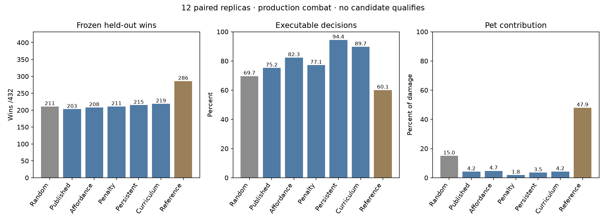

# Cadence action affordance learning — 2026-10-06

**No promotion.** On fresh held-out worlds, curriculum wins 219/432 versus random 211,
a +1.85-point difference with a paired replica bootstrap 95% interval of −1.39 to +5.09
points. It misses the five-point margin, its confidence interval includes zero, and its
pet damage share is 4.18% versus random's 14.96%. All candidate failures remain recorded.
Production combat, the action indices, and the published battle pack are unchanged.

## Protocol and isolation

Start: `925cdbec4399b249bbf1872a26edfaad217d2547`.
[Predeclared protocol](../sim/action_learning_protocol.json) was written before evaluation.
Seven primary held-out arms; the 26-sense and 29-sense controls and training-only owner
pressure are validation diagnostics, not additional held-out candidates. All base training
and validation completed before selecting the curriculum configuration, and before opening
any held-out worlds. Selection chose **affordance** by validation pet damage share among
eligible affordance/penalty/persistent arms, with the stated win-regression bound.
No tuning used held-out results; no candidate is used by the page or production server.

Twelve independent brain replicas: 60 training, 12 frozen validation, 36 frozen evaluation
encounters each. Main scenario and brain training seeds are 7000–7011; validation 8000–8011;
held-out 9000–9011. These differ from the preceding 1000/2000/3000 panel, so the earlier
199/205/209 counts are not denominators for this comparison. Frozen evaluation uses the
unchanged `scenario` generator, `AdventureService` combat and production-blocked timing,
including shifted positions, health, stats, obstacles and 0/200/800ms response delays.
No owner damage scaling or curriculum transformation occurs in final evaluation.

The architecture remains one `Brain.compose(inputs, 7, modules=(64,))`, with published
Genes/trace settings and Cadence 0.74.0. The published arm uses the published host sources.
Memory remains a drive within the complete reciprocal settlement; there is no external
answer path, action mask, teacher, replacement choice, or extra neural region.
Experimental checkpoints require `cadence-action-learning-v1`, their sense arm and motor
version; production `BattleHost` rejects them. Published pack bytes match the starting base.

## Physical affordances, rewards and motors

C adds three normalized binary senses to the published 16: ATTACK executable, SPECIAL
executable (range, line of sight and cooldown), and a currently available approach while
outside attack range. D adds the same three to the previous 26. Existing distance/cooldown
senses remain. No target identity, desired action, reward answer or curriculum label is added.
These senses describe possibilities; every one of the seven choices remains available.
`canApproach` describes the matching motor's actual path feasibility, including owner tether.

Reward controls use original `battleReward`, including its −0.08 waste term. The penalty
arm adds **−0.24 per executed invalid choice**, once at the next outcome closure, bounded
in [−1,1]. Refused/unexecuted responses do not incur this penalty. No repeated escalation
or cooldown-specific extra arm was added. Common reward and shaped reward are recorded
separately; tests pin the range, cooldown and action-ownership boundaries.

The existing `short-hop-v1` MOVE_CLOSER installs a 65px straight hop; motion can complete it
across approximately 0.4 seconds of ticks. It is not literally a one-tick displacement.
The candidate `approach-target-v2` keeps index 4 and uses existing `NavigationService`
pathfinding only after Cadence chooses MOVE_CLOSER. Movement remains 165px/s and stops
at executable attack range, a failed segment/tether, changed target identity or >40px target
displacement, 2800ms, or the next high-level decision. Invalid ATTACK/SPECIAL never starts
this motor. MOVE_AWAY keeps the original hop. There is no runtime fallback or A* chooser.

## Validation and curriculum

| Senses / diagnostic | Validation wins /144 | Pet damage share |
|---|---:|---:|
| published | 82 | 4.78% |
| expanded | 92 | 3.97% |
| affordance | 86 | 4.79% |
| expanded_affordance | 83 | 4.10% |
| penalty | 87 | 1.28% |
| persistent | 87 | 3.61% |
| curriculum | 93 | 3.45% |
| pressure | 93 | 6.39% |


The six ten-episode curriculum stages are close/ready/open, medium/ready/open,
far/ready/open, far with cooldown variation, obstacles, and full randomized scenarios.
Curriculum uses the selected affordance configuration; it improves validation wins from
86 to 93 and held-out wins from 208 to 219, but fails the promotion gate and contributes
less pet damage share. The separate pressure diagnostic trains on the unchanged full
scenario mix with owner hit amounts multiplied by 0.5. Its frozen validation restores
normal owner combat: 93 wins and 6.39% pet damage share. This is not held-out evidence
and was never eligible for promotion or curriculum selection.

## Frozen held-out outcomes

| Arm | Wins /432 | Executable | ATTACK valid | SPECIAL valid | Pet damage share |
|---|---:|---:|---:|---:|---:|
| random | 211 | 69.65% | 26.34% | 22.04% | 14.96% |
| published | 203 | 75.19% | 23.13% | 8.15% | 4.15% |
| affordance | 208 | 82.29% | 46.97% | 7.03% | 4.69% |
| penalty | 211 | 77.12% | — | 6.90% | 1.84% |
| persistent | 215 | 94.38% | 24.74% | 0.00% | 3.48% |
| curriculum | 219 | 89.67% | 25.58% | 8.74% | 4.18% |
| mother | 286 | 60.09% | 100.00% | 100.00% | 47.90% |


| Candidate | Gain vs random, pp | Paired replica bootstrap 95%, pp |
|---|---:|---:|
| affordance | -0.69 | -4.40 to +2.78 |
| penalty | +0.00 | -3.70 to +3.70 |
| persistent | +0.93 | -3.01 to +4.40 |
| curriculum | +1.85 | -1.39 to +5.09 |


Each confidence interval resamples the 12 paired replica win-rate differences (20,000 draws),
not thousands of decisions as independent samples. Summary receipts also include conservative
four-candidate familywise intervals and all predeclared factor classes. No interval supports
a robust improvement. The reference is disclosed privileged structure and never trains a brain.
A supplementary post-evaluation, disclosed WAIT-only diagnostic wins **191/432** with
zero pet damage on these same worlds; it is not a learned arm or a selection control.



## Action balance and invalidity

| Arm | Approaches | Valid attack after approach | Moving seconds / encounter | Encounters with valid ATTACK | Longest invalid streak |
|---|---:|---:|---:|---:|---:|
| random | 677 | 71 | 0.79 | 116 | 8 |
| published | 0 | 0 | 0.16 | 26 | 38 |
| affordance | 980 | 26 | 0.44 | 27 | 38 |
| penalty | 1233 | 0 | 0.63 | 0 | 38 |
| persistent | 444 | 4 | 0.02 | 24 | 38 |
| curriculum | 307 | 0 | 0.22 | 22 | 38 |
| mother | 1567 | 208 | 0.22 | 378 | 38 |


“Attack after approach” counts an executable ATTACK following a successful approach selection
before the next executable ATTACK; it does not fabricate an attack when motion completes.
Moving time counts actual displacement. The receipts include first-valid-attack time per
encounter and its median among encounters that had one; encounters without any remain counted.
High aggregate executable rates can be dominated by always-executable guards and WAIT.
Penalty's zero ATTACK selections are a collapse, not a perfect attack-validity score.

| Arm/action | Valid | Out of range | Cooldown (primary) | Blocked line (primary) |
|---|---:|---:|---:|---:|
| random ATTACK | 172 | 347 | 0 | 134 |
| random SPECIAL | 151 | 27 | 101 | 406 |
| published ATTACK | 65 | 127 | 0 | 89 |
| published SPECIAL | 26 | 12 | 86 | 195 |
| affordance ATTACK | 93 | 45 | 0 | 60 |
| affordance SPECIAL | 18 | 20 | 47 | 171 |
| penalty ATTACK | 0 | 0 | 0 | 0 |
| penalty SPECIAL | 30 | 15 | 77 | 313 |
| persistent ATTACK | 96 | 119 | 0 | 173 |
| persistent SPECIAL | 0 | 2 | 1 | 0 |
| curriculum ATTACK | 77 | 91 | 0 | 133 |
| curriculum SPECIAL | 25 | 20 | 66 | 175 |


This confusion table uses the first failed condition as the primary reason. Full overlapping
reasons are retained in the summary. Every executed decision receipt includes observation-time
and execution-time possibility, signed distance to the range threshold, cooldown milliseconds,
line/path/tether reasons, guard state, recent eight actions' invalid flags, stale possibility
changes, chosen action, policy probabilities and invalid streak. Invalid reasons that never
occurred (including unavailable species abilities in this two-species panel) are not invented.
“Already close” is explicitly recorded for approach, even when the old motor can execute a
useless hop. Observation/execution transition counts distinguish stale decisions from choices
that were already impossible when observed.

## Why ATTACK repeats, and why approach does not become useful

The measured failure is **weak context-conditioned action discrimination**, rather than only
an absent range bit or an exclusively stale response problem. Published already senses range
and cooldown. In diagnostic replay of seeds 7000–7002, each trained published brain chose the
same argmax across near-ready, far-ready, near-cooldown and obstacle observations. Two brains
preferred ATTACK everywhere, with mean maximum policy probabilities 0.925 and 0.959; their
largest pairwise policy L1 changes were only 0.0042 and 0.0010. Adding explicit affordances
changed which action became preferred, but did not produce context-dependent argmax choices
in these diagnostic brains. All six tested configurations' three trained clones had the same
argmax across the four contrasting contexts.

Clearing the working trace on private diagnostic clones left these two ATTACK preferences
intact. It changed one published clone's SPECIAL preference to almost-uniform probabilities,
so trace can matter, but trace alone does not explain the durable ATTACK collapse. The probes
use `Brain.imagine` through `Life.probe`; tests verify they preserve live checkpoint, activity,
randomness and pending feedback. They are observations of the trained mechanisms, never an
answer path or a held-out intervention. Three diagnostic seeds do not establish a universal
cause or isolate basal-ganglia learning from associative memory.

The training feedback also gives weak action-sequence discrimination. Motion receives no
explicit credit for reaching range; its benefit arrives later through a chosen attack. Owner
kills can supply victory reward to the preceding pet choice even when it was invalid. The
training-only audit directly captures the reward delivered to the executed choice:

| Training diagnostic (3 brains) | Invalid outcomes credited | Positive invalid outcomes | Mean invalid reward |
|---|---:|---:|---:|
| published | 876 | 10 | -0.140 |
| affordance | 156 | 0 | -0.144 |
| penalty | 464 | 0 | -0.379 |


All ten positively credited invalid published choices coincided with owner victory; three
had zero pet damage in the entire encounter. Yet most invalid choices were negative already,
so occasional terminal credit is not a sufficient explanation by itself. Strengthening waste
removed ATTACK entirely in held-out evaluation instead of teaching when to attack. Affordance
restored approach selections (980) but yielded only 26 subsequent valid attacks; persistent
pathfinding produced only four. These results support insufficient learning of a contextual
approach→attack sequence and selection of cheap defensive/passive behavior. They do not prove
that a particular learning-rate, exploration, trace or memory change would fix it; those were
not swept. Architecture expansion is not justified by these measurements.

## Obstacles and species transfer

| Arm | Obstacle wins /220 | Open wins /212 | Moonfox wins | Woodland Deer wins |
|---|---:|---:|---:|---:|
| random | 57 | 154 | 109/237 | 102/195 |
| published | 52 | 151 | 105/237 | 98/195 |
| affordance | 56 | 152 | 104/237 | 104/195 |
| penalty | 54 | 157 | 104/237 | 107/195 |
| persistent | 58 | 157 | 104/237 | 111/195 |
| curriculum | 56 | 163 | 113/237 | 106/195 |
| mother | 110 | 176 | 149/237 | 137/195 |


Persistent navigation wins 58 obstacle encounters versus random's 57, with 3.13% obstacle
pet damage share. Its recorded motor stops include 26 in-range completions, 25 material target
changes and nine path failures; pathfinding alone did not yield useful combat sequences.
The candidate does not show catastrophic obstacle win regression, but also offers no proven
obstacle competence gain. Guards inflate its 94.38% aggregate executable rate.

Whole-species transfer uses six independent seed pairs per direction, training 60 encounters
only on one species and evaluating 36 frozen encounters on the other. Physical training seeds
11000–11005 / 12000–12005; native brain seeds 18000–18005 / 19000–19005; evaluation seeds
13000–13005 / 14000–14005. Curriculum and the selected base arm were fixed before held-out.
Each cell below is out of 216:

| Direction | Random | Published | Affordance | Curriculum | Reference |
|---|---:|---:|---:|---:|---:|
| moon-forest | 107 | 112 | 108 | 109 | 150 |
| forest-moon | 104 | 100 | 108 | 112 | 144 |


Both affordance confidence intervals include zero. Curriculum's paired 95% interval is
−2.31 to +4.17 points Moonfox→Deer and +0.46 to +9.26 points in reverse. The latter
unadjusted interval excludes zero, but the other direction and primary held-out interval
do not support gain. This does not establish robust transfer in both directions. Production Moonfox and
Woodland Deer ability mappings, cooldowns, damage and owner auto-attacks remain untouched.

## Gate, checks and reproduction

**Nothing promoted.** Every candidate misses the held-out margin and confidence requirement,
and every candidate's pet damage share is below random. Penalty also collapses the ATTACK
class. Native main and transfer evaluations verify unchanged weight hashes, update counts
and memory writes. Continuation tests cover all six sense/reward/motor host configurations,
including pending outcomes. Production and cross-body checkpoint rejection, normalized
physical cues, range/cooldown equality, path availability, motor stop conditions, action index
stability, no auto-substitution, single terminal closure and immutable packs are tested.

```sh
node sim/action_learning_run.mjs --python /path/to/python --output runs/action-learning.json
python -m sim.action_learning_summary runs/action-learning.json docs/assays/action-learning-summary.json
node sim/action_learning_probe.mjs --python /path/to/python
python -m sim.action_learning_probe_summary runs/action-probes runs/action-probe-summary.json
node sim/action_learning_credit_audit.mjs --python /path/to/python
node sim/server_battle_owner_only.mjs --seed 9000 --output runs/action-owner-only.json
python -m pytest -q tests
TEST_DATABASE_URL=postgresql://... npm test
```

Use Cadence 0.74.0 and a disposable PostgreSQL database for the full application suite.
The full suite passes **42 Python and 227 JavaScript tests, no skips**. Runtime/trained
checkpoints stay local; no experimental brain pack ships.

[Full compressed decision receipts](assays/action-learning.json.gz),
[summary and confidence/class counts](assays/action-learning-summary.json),
[private probe results](assays/action-learning-probes.json),
[executed-credit audit](assays/action-learning-credit-audit.json.gz) and
[WAIT diagnostic](assays/action-learning-owner-only.json.gz) preserve the failures.
Execution source hashes and the measured host source snapshot accompany raw receipts;
a post-evaluation JSON serialization fix only wraps list-valued read-only probe responses
and does not change tick/learning behavior.

Limits: 60 training encounters per replica; one enemy and a static basic-sword owner;
controlled owner/pet pressure draws; no exploration/trace/learning-rate sweep; diagnostic
probes sample only three replicas and four contexts. Approach can be interrupted by moving
targets, and low pet contribution remains unresolved. The next useful test should measure
context-sensitive acquisition and owned delayed movement benefit against this simple control,
without altering production physics or hiding action choice in navigation code.
