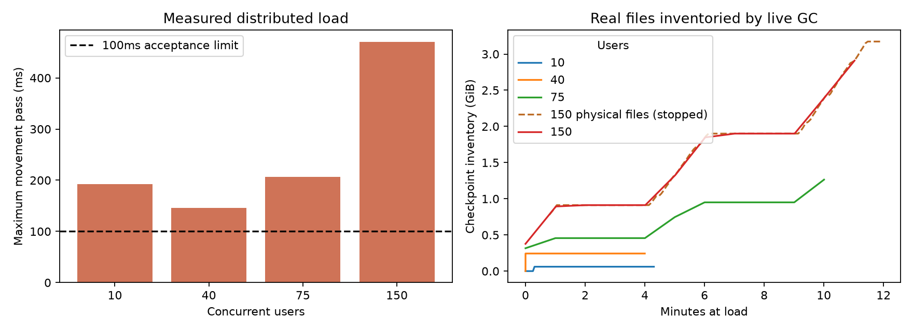

# Multiplayer capacity certification

Base: `925cdbec4399b249bbf1872a26edfaad217d2547`.

## Predeclared protocol

**Final result: NOT CERTIFIED.** The following protocol was declared before load. Sequential independent
PostgreSQL schemas and real authenticated sockets: 10/300s, 40/300s, 75/600s,
150/1800s at load, preceded by both species' authoritative follow acceptance.
Room weights Town 3, Forest/Lake/Market/Exchange 1 each; capacity 40. One active
owned pet per user, real native background learning, movement/change/stop,
room transition, planned reconnect, emotes/preset speech and safe interactions.
No purchases, payments, token rewards or resource claims. Combat lifecycle is a
separate correctness experiment, not silently included in safe-movement load.

All four retention settings explicitly match development defaults: recent 3,
age 0h, interval 60s, grace 600s. Record actual storage inventory, creation/write/
delete/GC counters and available disk every five seconds. Stop below 3 GiB free.
A safety stop fails certification; no clock acceleration or shortened soak qualifies.
Bounded equilibrium requires live physical deletion and repeated plateau cycles,
not the preexisting model alone. No multi-hour extension on limited disk.

Acceptance predeclared before load: no unexplained navigation/interaction errors,
server/harness errors, unexpected disconnects, wrong/missing companions, stale
actors, retained players/rooms/sockets/idle or active adventure states, backpressure
drops, critical overflow/resync, or GC errors. Every movement pass below 100ms;
event-loop window p99 <=100ms and maximum <=1000ms. Critical queue must drain.
Planned reconnect transients may reduce sampled membership by the number of
explicitly reconnecting actors only, with restored owned identity and zero cleanup
leaks. Historical strict harness acceptance is also reported without relabeling.

Additional independent profiles: 50/100/200ms RTT, 100ms with +/-25ms one-way jitter,
100ms with 1% loss, and 100ms with short burst loss. Transport preserves FIFO and
reliable events; loss emulates TCP retransmission stalls (+200ms; +1000ms bursts)
in the harness, not packet corruption or a full kernel TCP/congestion simulation.
Run 40 users/60s each. Local TLS proxy: 40/60s matched direct control; no capacity
claim from short profiles. Single Town room 50/75/100 users for 60s each. Current
production capacity validates <=100; 150 in one room is unsupported and will not
be enabled by weakening that limit. Distributed 150 is a separate claim.

Every rejection retains server logical position/room/user/request/destination,
walkability/range reason/target/radius/request age plus harness dispatch origin.
The harness has no rendering prediction; predicted position is explicitly null.
Classify measured failures A legitimate request, B stale-client timing, C harness,
D server validation, E geometry/pathfinding; unexplained remains a blocker.

## Proven failures and fixes

The initial 10-user/30-second diagnostic (before geometry repair) recorded one
unreachable movement request from authority `(835.853455654,812.410246446)` to
`(1150,520)` in Town. The origin was inside the rectangle centered `(900,800)`
with footprint `130x25`; the requested endpoint was walkable. This is class E:
the prior route had been accepted using 10-unit point samples, which can miss a
short collider-corner crossing. A deterministic route panel independently found
35 invalid interpolated points in Town and four in Exchange on accepted paths.

`validSegment` now intersects entire segments with the existing circle, rectangle,
Town ellipse and prop footprints. Bounds and both endpoints must remain walkable.
Shared client/server pathfinding routes around those footprints. No collider size,
interaction distance, speed, position authority or client-trust rule was relaxed.
The same probe after repair has zero blocked interpolated points, invalid route
segments or blocked rounded points (29,029 intermediate probes). Panel routes may
change because an old unsafe shortcut is now correctly rejected. Existing
pathfinding/follow/motor tests and a witnessed corner regression pass.

The diagnostic also recorded `Walk closer to talk`. The harness selected roaming
residents against authored `(x,y)`, rather than the existing time-dependent
`residentPosition`; Otto and Luna have witnessed >120-unit displacements. Class C:
server refusal is correct. Harness selection now uses current logical position
with a 65-unit approach margin. Static interaction selection also uses the same
server logical anchor and a conservative interior radius. Investigation of differing
Town prop/local radii found **no overlapping IDs**, so it did not establish a
server anchor bug. Predicted/render position is absent in this headless client;
its diagnostic field is null, not a fabricated prediction. WAN motion can still
invalidate a nearby interaction before arrival and remains an explicit rejection.

Opt-in IPC retains capped server rejection traces (overflow is counted), request
age, authoritative start, destination walkability, logical target/radius and room.
No extra position field is trusted and no diagnostic data is added to public wire
responses. Query latency instrumentation covers pool callbacks and transaction
clients. GC scan count, cumulative/max pass duration, and live disk-floor telemetry
are measurement additions; collection policy and checkpoint protection are unchanged.

## Encounter lifecycle: NOT CERTIFIED

`multiplayer/load-test/encounter-audit.mjs` uses an isolated real PostgreSQL schema,
owned pet and actual `BattleBrains` boot/tick/save. A barrier holds an actual native
reply after its DB transaction to reproduce departure races deterministically.
It does not supply a scripted action. Simulation advances the existing service clock
for the TTL probe; this is **not** 24 wall-clock hours.

- An active disconnected state remains `inBattle=true` after three ticks 24 hours
  later. Its room instance is removed, but no finish call or state eviction occurs.
  There is no disconnected-combat encounter TTL path.
- A pending native reply executes `petAction` after the player has disconnected.
- A room change during that reply executes the old encounter action in the new room.
- An ordinary room change between decisions closes the previous choice exactly once.
- Enemy leash loss clears its target and enters RETURN. Duplicate hits create one
  `combat_encounters` row; a killed Yard dummy respawns with a new identity.
  Dummy XP is zero by production design; this does not establish reward distribution
  for multi-contributor live enemies. Existing PostgreSQL tests cover ordinary loot/XP.

These races need an executed-action acknowledgement/cancellation and departure
settlement design that preserves brain credit and recovery. They were measured and
left as blockers rather than silently discarding pending learning state. This task
changes neither Cadence mechanisms nor published brain packs. Safe movement soaks
exclude active fighting and do not certify battle concurrency. Gathering/claim
behavior is covered by PostgreSQL tests but is absent from the CCU workload; no
payments/resource claims were sent. Full requested combat/gathering capacity remains
uncertified even if the movement-only run succeeds.

## Measurement limits

All runs use the same shared Apple development host and local PostgreSQL; other
work can contend for CPU and disk. Validation/probe work overlapped setup and part
of the ten-user run. There is no isolated production-hardware certification.
Exact source hashes are retained for each run; instrumentation additions between
stages are identified, not treated as present in old runs. The geometry repair and
authority rules are identical across the four post-fix stages.

Payload rates exclude TCP/TLS/WebSocket framing, retransmission, HTTP setup and
PostgreSQL traffic. Process-tree CPU/RSS covers the server and its native descendants,
not PostgreSQL, the generator, reverse proxy or other apps. Query latency is measured
through actual pg calls. Timing percentiles for tick/query are histogram upper
bounds, not fabricated exact percentiles. Host-side receipt latency includes harness
impairment; no rendering/FPS/physical-phone claim is made.

GC inventory updates after a collector pass; its timestamp can lag physical writes.
The 150-user and supplemental stages also stat the owned directory every five
seconds for actual file bytes/count/temp count, alongside filesystem free bytes.
These metadata snapshots can race a write/delete and are not atomic inventories.
Files written/deleted counters are genuine repository counters, not modeled demand.
After cleanup, owned directory bytes must be zero; generated schemas are dropped.
Earlier stages without physical directory sampling or exact overrun/queue-depth
counters report those fields as unmeasured. WAN stops remain validated destination
intents; no client origin is trusted. Awaiting acceptance naturally reduces offered
movement rate at higher RTT, so comparisons are workload-specific rather than
fixed-packet-rate transport saturation tests.


## Thirty-minute attempt: safety stopped, NOT CERTIFIED

The 150-user run requested 1800 seconds and stopped after **675.581 seconds** at
load when filesystem free bytes reached **3,151,851,520 (2.935 GiB)**. The declared
3 GiB floor triggered orderly teardown; it was not lowered. All 150 users were
connected, with planned reconnect transients to 149. No navigation errors, wrong/missing companions or retained room/player/socket/
idle adventure states were recorded. The legacy unexpected-close count was zero,
but the later measurement audit shows that count is inconclusive. Steady-window movement maximum was 469.95ms;
all captured windows including the initial phase-boundary window reached 947.21ms.
Both fail the 100ms acceptance limit. The initial window is excluded from the
legacy steady aggregate and is disclosed separately rather than hidden.

Native saves created **450 checkpoints**, wrote **3,406,823,107 bytes**, and deleted
**zero** during this attempt. The physical directory peaked at 3,406,823,226 bytes,
451 files including the ownership marker. Inventory lagged physical writes;
last load inventory reported 419 files/3,124,494,691 bytes. Last steady inventory
had 12 scans and a 2544.52ms maximum GC pass; a subsequent pass is in the raw windows.
GC/validation failures were zero, and no obsolete version was eligible under the
three-recent-file policy. The largest inventoried checkpoint grew to **9,107,934
bytes**, well above the historical 6,487,877-byte model input. Bounded file count
does not establish bounded byte equilibrium from this incomplete run. The test
never reached repeated live deletion/plateau cycles.

Owned files were removed only after the owned server exited; post-cleanup directory
bytes/count are zero and the disposable schema was dropped. Available disk recovered.
The 30-minute criterion is **not met**, and no two-hour extension was attempted.
Provision headroom using actual largest checkpoints, retained/protected counts,
pre-GC temporary/version peaks, PostgreSQL/backup growth and the safety reserve;
do not size this workload solely from the old representative-file model.

Supplemental ten-user/60-second mixed exercise (declared before its run): each
actor walks to Mina, requests vendor dialogue without buying, enters Yard, targets
a safe dummy using ordinary owner combat, stops and returns to Town. Cadence still
chooses all Mochi actions. One actor additionally starts and cancels ordinary
woodcutting; no completion reward/claim/payment is sent. It records real socket
replies and native battle decision events. This short correctness/workload check
cannot substitute for a 150-user mixed combat/gathering soak. Application-data
impairment does not delay WebSocket control frames, DNS/HTTP setup or implement
kernel congestion/loss; the TLS proxy uses current production WebSocket compression
default (disabled) and a local self-signed certificate exception restricted to its
loopback URL. No production TLS/protocol validation is weakened.

A measurement audit found the legacy `disconnects - reconnects` calculation can
hide an unexpected disconnect followed by automatic recovery. Earlier runs report
that legacy count; it is **not conclusive proof of zero unexpected disconnects**.
Server slow-close/backpressure counters and client errors were zero, but untyped
close traces cannot certify the negative. The harness now labels each socket close
before recovery, preserving code/reason and whether the actor initiated it; recovery
never erases an unexpected close. Planned reconnect intervals are recorded. This
instrumentation applies to later profiles; missing traces in old arms are unmeasured.
The first 50-user room run passed timing/follow/navigation but strict membership
failed on a sampled 49 users during its one reconnect; attribution was not typed.
Its failure remains. A supplemental audited 50-user room repeat is declared before
running to validate explicit disconnect classification, without replacing that arm.
The audited 50-user repeat uses 2% planned reconnect probability (baseline 0.2%)
to exercise close classification; it is a diagnostic arm, not a matched throughput
replacement. Client close traces include all normal/abnormal status codes, and
1013/server-error closes cannot become planned merely because recovery starts.
Validation work overlapped part of the 100-user crowd case and TLS-direct setup;
those measurements are also from a shared, contended development host.


## Completed measurements

Full compact counts, timings, disk series, source hashes, raw-file SHA-256 values,
rejection classifications and close traces: [ccu-certification.json](assays/ccu-certification.json).
All test data is disposable, with raw assays/window logs left locally under ignored
`assays/` and `data/`; credentials/cookies are not included in the retained summary.

| Distributed users | Actual seconds | Out MB/s | In kB/s | Recipient msg/s | Snapshot msg/s | Node CPU cores | App/native RSS MiB | Tick p50/p95/p99/max ms | Window loop p99 max ms | Result |
|---:|---:|---:|---:|---:|---:|---:|---:|:---|---:|:---|
| 10 | 300.325 | 0.083 | 1.040 | 153.8 | 85.2 | 0.034 | 475.1 | ≤1/≤4/≤16/192.78 | 51.61 | FAIL |
| 40 | 300.769 | 0.776 | 4.039 | 680.3 | 373.8 | 0.094 | 486.1 | ≤4/≤16/≤32/146.39 | 56.72 | FAIL |
| 75 | 600.442 | 2.300 | 7.409 | 1371.2 | 723.0 | 0.194 | 582.9 | ≤16/≤32/≤64/206.78 | 58.59 | FAIL |
| 150 | 675.581 | 5.682 | 14.242 | 2864.2 | 1448.7 | 0.354 | 854.1 | ≤32/≤32/≤64/469.95 | 61.60 | FAIL; disk stop |

Every post-repair distributed stage recorded zero navigation rejections, wrong/missing
companions and retained players/rooms/sockets/idle adventure states. Legacy unexpected
close counts were zero but are inconclusive under the subsequently fixed accounting.
No backpressure/slow-close/critical-overflow events were recorded. Both species passed
follow acceptance. The 150 run observed 149–150 players, 180 reconnects, Node/native
mean CPU 0.354/0.609 cores, Node RSS 325.1 MiB, heap maximum 130.0 MiB, and PostgreSQL
query p50/p95/p99 upper bounds 0.125/1/8ms (maximum 871.89ms). Native/world/trading
workers remained enabled. Movement/replication ticks are reported; combat/trading
phase timing is not claimed as a full 150-user mixed-workload measurement.

| Supplemental profile | Users | Actual seconds | Out MB/s | Tick max ms | Window loop p99 max ms | Receipt p95 ms | Legacy strict result |
|:---|---:|---:|---:|---:|---:|---:|:---|
| crowd100 | 100 | 60.291 | 12.497 | 976.41 | 477.36 | 41 | FAIL |
| crowd50 | 50 | 60.353 | 3.497 | 57.79 | 43.52 | 25 | FAIL |
| crowd50-audited | 50 | 60.472 | 3.624 | 96.53 | 54.72 | 36 | FAIL |
| crowd75 | 75 | 60.299 | 7.647 | 185.51 | 80.74 | 37 | FAIL |
| mixed-exercise | 10 | 60.499 | 0.156 | 13.61 | 16.94 | 6 | PASS |
| tls-direct | 40 | 60.109 | 0.850 | 44.49 | 19.71 | 10 | PASS |
| tls-proxy | 40 | 60.632 | 0.711 | 53.10 | 24.63 | 10 | PASS |
| wan-burst | 40 | 62.715 | 0.666 | 41.38 | 26.08 | 151 | PASS |
| wan-jitter | 40 | 60.486 | 0.746 | 42.35 | 20.53 | 78 | PASS |
| wan-loss | 40 | 60.347 | 0.644 | 28.00 | 30.92 | 67 | PASS |
| wan100 | 40 | 61.161 | 0.755 | 29.32 | 24.41 | 61 | PASS |
| wan200 | 40 | 60.686 | 0.749 | 24.87 | 22.07 | 110 | PASS |
| wan50 | 40 | 60.480 | 0.636 | 30.87 | 20.23 | 35 | PASS |

The audited 50-user repeat recorded 52 typed planned closes and zero unexpected
closes. Its sampled deficit (49 players/companions) matches one active planned
reconnect interval. Movement maximum 96.53ms is within budget. However, an initial
phase-boundary window recorded a **2117.07ms event-loop maximum**, failing the
conservative all-captured-window maximum gate. The planned membership transient is
explained; **this does not convert the arm to an overall pass**. The unmodified
strict harness also fails membership. Neither that flag nor the initial-window
stall is silently removed. Earlier crowd50 fails strict membership without typed
traces; crowd75 fails movement timing; crowd100 reaches 976.41ms movement maximum
and violates event-loop gates. A single-room 150-user case is unsupported by the
unchanged 100-player limit and was not run.

All six WAN profiles pass their original short strict checks, with no rejection
traces. They have legacy disconnect accounting and cannot prove absence of recovered
unexpected closes. Loss is simulated retransmission delay, not deletion of reliable
critical messages or kernel TCP emulation. Long-duration impaired capacity remains
unmeasured. TLS-direct/proxy both pass with explicit close-intent audit, zero
unexpected closes and 10ms receipt p95 each. Maximum movement pass changes
44.49→53.10ms; maximum window event-loop p99 changes 19.71→24.63ms. These are
common-configuration short samples with varying offered actions and host contention,
not a controlled causal estimate of TLS overhead. Proxy CPU/RSS is excluded from
application/native totals; HTTP/WS framing and TLS bytes are not application payload
counters. HTTPS login and authenticated WSS upgrades exercised the local proxy.

The ten-user mixed exercise passed: ten vendor dialogues and safe dummy targets,
one gathering start/cancel, nine native battle decision events, no reward claims
or payments, and zero retained adventure/room/player/socket state. It demonstrates
normal between-decision cleanup; the independently reproduced pending-response and
active-disconnect races still block certification. It is not a 150-user mixed soak.



## Validation and reproduction

- `npm test`: **224 passed, 0 failed, 0 skipped**, PostgreSQL enabled.
- `npm run test:movement`: **42 passed, 0 failed, 0 skipped**.
- `npm run build`: passed, including asset validation.
- Python: **33 passed**. Checkpoint PostgreSQL subset: **21 passed**, including
  physical deletion/stabilization, current/recent/pin/lease protection and domain isolation.
- Native encounter audit uses real PostgreSQL/BattleBrains and preserves measured failures.
- `git diff --check`: passed. No diff in published packs, `mochi/`, trading brain
  service, Pixi rendering or art. No new pack was created.

Use an isolated PostgreSQL test database and normal native dependencies. Supply
`TEST_DATABASE_URL` through the environment, never a production database. The
controller creates/drops independent schemas and owns its checkpoint directories.

```sh
npm run bench:multiplayer -- --users=10 --seconds=300 --label=standalone
node multiplayer/load-test/certify.mjs
node multiplayer/load-test/navigation-audit.mjs
node multiplayer/load-test/encounter-audit.mjs
node multiplayer/load-test/summarize-certification.mjs
.venv/bin/python multiplayer/load-test/plot-certification.py
```

The controller now expresses the complete sequential protocol including supplemental
TLS/mixed/typed-close profiles; actual earlier source variants are identified by
per-assay hashes. Capacity does not become certified merely by replaying this script.
Provide sufficient headroom to complete 30 minutes, repeat on isolated candidate
hardware with explicit production retention settings, repair/validate encounter
acknowledgement and TTL, retain typed close/membership traces throughout, and test a
full realistic 150-user mixed workload plus sustained WAN/TLS/browser behavior.
